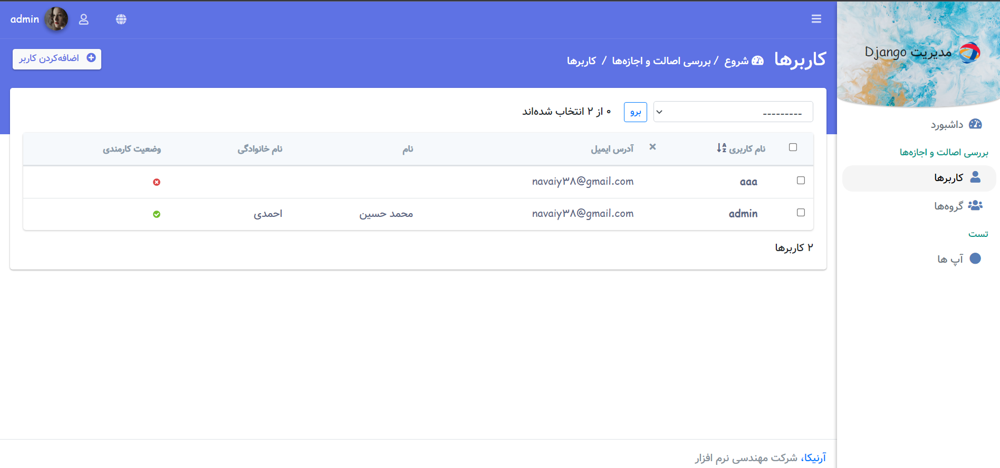
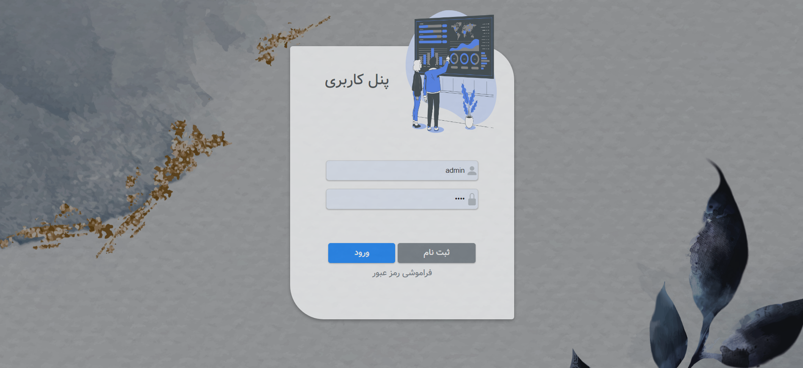
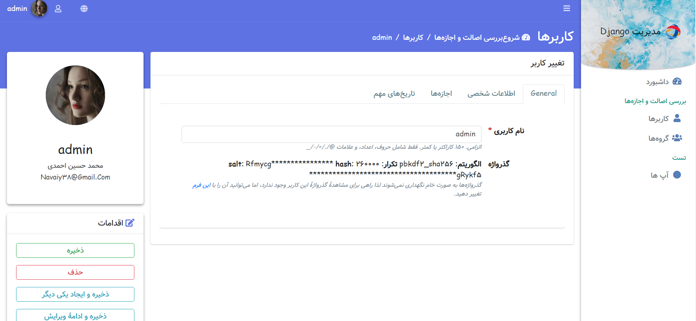

This admin panel has been edited by jazzmin and works only for the right languages






## Installation
```
pip install git+https://github.com/navaiy/admin-panel.git@main/jazzmin
```
Add jazzmin to the first list before admin app
```
INSTALLED_APPS = [
'jazzmin',
]
```
change in settings.py
```
LANGUAGE_CODE = 'fa-ir'
```
add to urls.pu
```
from django.urls import include
from jazzmin.view import register

urlpatterns = [
    path("i18n/", include("django.conf.urls.i18n")),
    path("", include("django.contrib.auth.urls")),
    path('register', register, name='register'), ]
]
```
